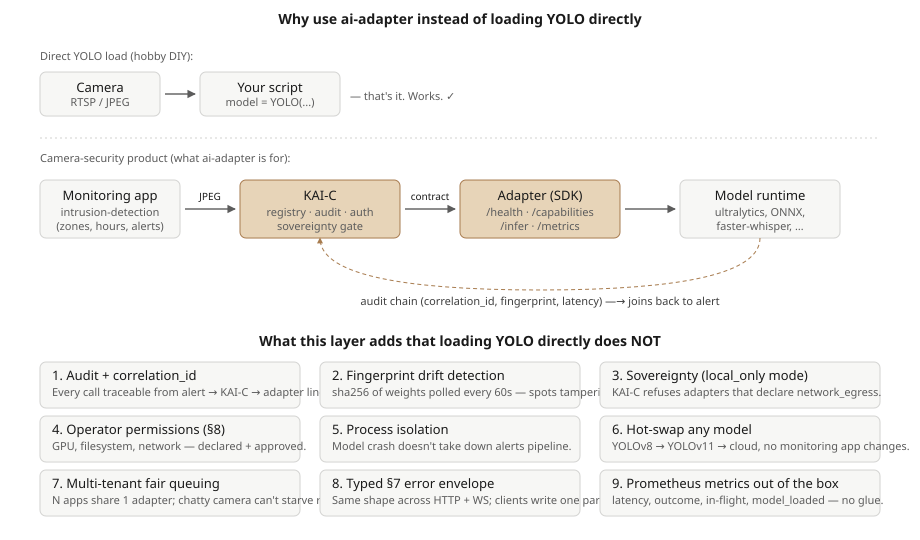

<div align="center">

### OpenNVR AI Adapter

**The pluggable inference layer for [OpenNVR](https://github.com/open-nvr/open-nvr).**
Drop any model behind a REST or WebSocket endpoint, and it becomes a first-class
detector with audit, drift-detection, and sovereignty controls.

[](LICENSE)
[](https://www.python.org)
[](https://fastapi.tiangolo.com)
[](https://pypi.org/project/opennvr-adapter-sdk/)
[](https://huggingface.co/models)

[Write your own adapter](#-write-your-own-adapter) · [Install profiles](#-install-profiles)
· [What ships](#-what-ships) · [Contract spec](https://github.com/open-nvr/open-nvr/blob/main/docs/AI_ADAPTER_CONTRACT.md)

</div>

---

## ⚡ 30-second SDK install

```bash
pip install opennvr-adapter-sdk
```

```python
from opennvr_adapter_sdk import (
    AdapterApp, AdapterService, BodyShape,
    HardwareEvaluationResponse, HardwareVerdict,
    InferResponse, ModelInfo,
)

class MyDetector(AdapterService):
    def load(self):                                  # eagerly load weights
        ...

    def is_ready(self) -> bool:
        return True

    def fingerprint(self) -> str | None:             # sha256 of the weights
        return "sha256:..."

    def model_info(self) -> ModelInfo:
        return ModelInfo(name="my-model", version="1.0.0",
                         framework="onnx", fingerprint=self.fingerprint())

    def hardware_evaluation(self) -> HardwareEvaluationResponse:
        return HardwareEvaluationResponse(verdict=HardwareVerdict.OK, details="")

    def infer(self, payload) -> InferResponse:
        frame_bytes = payload["__file__"]
        # ... run your model ...
        return InferResponse(result={"detections": [
            {"label": "person", "confidence": 0.93, "bbox": [10, 20, 100, 200]},
        ]})

app = AdapterApp(
    service=MyDetector(),
    name="my-detector", version="1.0.0", vendor="me", license="MIT",
    tasks_advertised=["object_detection"],
    body_shape=BodyShape.IMAGE,
).fastapi_app
```

`uvicorn my_module:app --port 9100`, then `POST` that URL to KAI-C's
`/api/v1/adapters/register` — it's online and hot-swappable.

---

## 🎯 Why this layer exists

For a single-camera hobby project you genuinely don't need it. `pip install
ultralytics` and run YOLO in a loop is shorter and faster.

This layer exists because a **security product** has cross-cutting concerns that no
ML library will give you. The trade-off is the same as `docker run` vs Kubernetes:
the abstractions earn their keep at the scale and stakes where direct calls become
liabilities.

<div align="center">



</div>

### What you get vs. loading a model directly

| Concern | Direct `from ultralytics import YOLO` | OpenNVR AI Adapter |
|---|---|---|
| **Audit + correlation ID** | Not built-in | One `X-Correlation-Id` per call, joined alert → middleware → adapter |
| **Fingerprint drift detection** | Impossible without rolling your own | sha256 polled every 60s, surfaced as `adapter.fingerprint_mismatch` events |
| **Sovereignty enforcement** | Self-enforce in your code | Middleware refuses to register an adapter that violates the policy |
| **Operator-gated permissions** | Implicit | Adapter declares GPU / filesystem / network egress in `/capabilities` |
| **Process isolation** | One Python process, one OOM | Each adapter is its own container with its own limits |
| **Hot-swap any model** | Rewrite your script | Operator changes one config line — YOLOv8 → YOLOv11 → cloud |
| **Multi-tenant fairness** | Each app owns its model | One adapter, per-camera fair-queuing declared in `/capabilities` |
| **Typed error envelope** | Invent your own | `ServiceError` with `category`, `code`, `transient`, `retry_after_ms` |
| **Prometheus metrics** | Wire it yourself | Same labels across every adapter, built into the SDK |

### When you actually need it

| If you... | Use direct `ultralytics` | Use the adapter |
|---|---|---|
| One camera in your garage | ✓ | overkill |
| Prototype a detection idea | ✓ | overkill |
| Ship a security product to operators | dangerous | ✓ |
| Need to prove "AI didn't lie" in an incident | impossible | the audit chain is the proof |
| Swap YOLOv8 → YOLOv11 without rewriting alerts | painful | one config line |
| Enforce "no cloud calls ever" | self-police | middleware refuses non-compliant adapters |
| Run multiple monitoring apps on shared GPU | each owns its model | one adapter, fair-queued |

---

## 📦 What ships

The repo is two things in one:

1. **`opennvr-adapter-sdk`** — the small, Apache-2.0 SDK that adapter authors install
   from PyPI. Three classes (`AdapterService`, `AdapterApp`, `ServiceError`) and a
   handful of result models. Zero ML dependencies.
2. **The reference adapter server** — a FastAPI service in `app/` that ships YOLOv8,
   InsightFace, Whisper, Piper, BLIP, HuggingFace, and Ollama as ready-to-use
   adapters. Use it as-is, or read it as the canonical example of an adapter host.

```
ai-adapter/
├── opennvr_adapter_sdk/      # The SDK published to PyPI
├── app/
│   ├── adapters/             # Reference adapters (auto-discovered)
│   │   ├── vision/           # YOLOv8, YOLOv11, InsightFace, BLIP, HuggingFace
│   │   └── llm/              # BLIP, HuggingFace, Ollama
│   ├── pipelines/            # Task business logic (auto-discovered)
│   └── ...
├── conformance/              # Wire-contract conformance test suite
└── docs/                     # Architecture, plugin dev, API reference
```

---

## 🚀 Run the reference server

```bash
git clone https://github.com/open-nvr/ai-adapter.git
cd ai-adapter

uv venv && source .venv/bin/activate          # macOS / Linux
# Windows: uv venv && .venv\Scripts\activate

uv sync --extra all --extra cpu               # full install (CPU)
uv run python download_models.py              # fetch model weights
uv run uvicorn app.main:app --reload --port 9100
```

On startup you should see:

```
INFO - Server ready. Discovered tasks=N adapters=M
```

The server auto-discovers everything under `app/adapters/` and `app/pipelines/`.
Add a file, restart, you're live.

---

## 📐 Install profiles

Dependencies are split into optional groups so a minimal deployment installs ~9
packages and only grows when you ask for more.

| Profile | Command | What you get | Approx size |
|---|---|---|---|
| **Core only** | `uv sync` | FastAPI, uvicorn, pydantic, numpy, opencv | ~50 MB |
| **YOLOv8 detection** | `uv sync --extra yolo` | + onnxruntime | ~250 MB |
| **YOLOv11 counting** | `uv sync --extra yolo11 --extra cpu` | + ultralytics + torch CPU | ~2.5 GB |
| **Face recognition** | `uv sync --extra face` | + insightface + onnxruntime + scipy | ~500 MB |
| **Scene captioning** | `uv sync --extra blip --extra cpu` | + transformers + torch CPU | ~3 GB |
| **HuggingFace cloud** | `uv sync --extra huggingface` | + huggingface_hub | ~60 MB |
| **Whisper STT** | `uv sync --extra stt` | + faster-whisper | ~300 MB |
| **Piper TTS** | `uv sync --extra tts` | + piper-tts | ~100 MB + 25 MB/voice |
| **Ollama LLM** | *(no extras)* | uses core `httpx` | ~0 MB in this repo; you still need Ollama installed separately |
| **Everything** | `uv sync --extra all --extra cpu` | all adapters, CPU torch | ~4 GB |
| **Everything + GPU** | `uv sync --extra all --extra gpu` | all adapters, CUDA torch | ~6 GB |

> Most NVR deployments only need `--extra yolo --extra face` (~750 MB) for person
> detection + face recognition.

---

## 🧩 Write your own adapter

Adding a model takes **3 files** and **zero changes to existing code**.

### 1. The adapter

```python
# app/adapters/vision/fire_adapter.py
from app.adapters.base import BaseAdapter

class FireAdapter(BaseAdapter):
    name = "fire_adapter"
    type = "vision"

    def __init__(self, config=None):
        self.config = config or {}
        self.model = None

    def load_model(self):
        # Import heavy ML libs INSIDE load_model() — keeps discovery fast.
        import onnxruntime as ort
        self.model = ort.InferenceSession("model_weights/fire.onnx")

    def infer_local(self, input_data):
        # Load image, run model, return raw results
        return {"label": "fire", "confidence": 0.95, "bbox": [100, 80, 200, 150]}
```

### 2. The routing entry

```python
# app/config/config.py
TASK_ADAPTER_MAP = {
    # ... existing ...
    "fire_detection": "fire_adapter",
}
CONFIG["adapters"]["fire_adapter"] = {"enabled": True, "weights_path": "fire.onnx"}
```

### 3. (Optional) A task pipeline for validated output

```python
# app/pipelines/fire_detection/task.py
from app.interfaces.task import BaseTask

class FireDetectionTask(BaseTask):
    name = "fire_detection"

    def process(self, image, adapter):
        raw = adapter.predict(image)
        return FireDetectionResponse(**raw)   # Pydantic-validated
```

**That's it.** No imports in `main.py`. No registration code. `PluginManager`
auto-discovers your classes at startup.

> **Important:** Declare your adapter's ML libraries as a new
> `[project.optional-dependencies]` group in `pyproject.toml` — never add them to
> `[project.dependencies]`. Import them inside `load_model()`, not at module top.
> This keeps the project lean for everyone.

→ Full tutorial: **[docs/PLUGIN_DEVELOPMENT.md](docs/PLUGIN_DEVELOPMENT.md)**
→ Architecture deep-dive: **[docs/ARCHITECTURE.md](docs/ARCHITECTURE.md)**
→ API reference: **[docs/API_REFERENCE.md](docs/API_REFERENCE.md)**

---

## 🎯 Adapters we'd love to see

Contributions in any of these areas are on the roadmap and explicitly welcome:

| Category | Ideas |
|---|---|
| **Safety / security** | Weapons detection, fire / smoke detection, fall detection, PPE compliance |
| **Access & identity** | License-plate recognition (ANPR), uniform / ID-badge detection, gait recognition |
| **Analytics** | Crowd density, queue length, dwell-time heatmaps, vehicle classification |
| **Audio** | Glass-break detection, gunshot detection, aggression detection, diarisation |
| **Conversational agents** | Function-calling LLM adapters, RAG-over-events, on-call escalation flows |
| **Animals & wildlife** | Pet / livestock detection, wildlife classification, bird-species ID |
| **Edge optimisation** | TensorRT / OpenVINO / CoreML variants for Jetson, NUC, Apple Silicon |

Have another idea? Open a
[discussion](https://github.com/open-nvr/ai-adapter/discussions) before you start
coding — we'll help scope it.

---

## 📡 API overview

| Endpoint | Method | Description |
|---|---|---|
| `/health` | GET | Server health + loaded adapter status + hardware info |
| `/capabilities` | GET | Wire-contract capability advertisement |
| `/tasks` | GET | Available tasks with adapter info |
| `/schema` | GET | Response schema for one or all tasks |
| `/infer` | POST | Run a single task inference |
| `/pipeline/run` | POST | Run a chain of tasks sequentially |
| `/adapters` | GET | List currently loaded adapters |
| `/faces/register` | POST | Register a face for recognition |
| `/faces/{person_id}` | GET / DELETE | Get or delete a registered face |

> WebSocket streaming (`/infer/stream`) is part of the contract and supported by
> the SDK's `AdapterApp`. The reference server in this repo currently exposes only
> the HTTP surface above; SDK-based adapters built against `AdapterApp` get the
> WebSocket route automatically.

Full wire spec: **[AI Adapter Contract](https://github.com/open-nvr/open-nvr/blob/main/docs/AI_ADAPTER_CONTRACT.md)**.

---

## 🐳 Docker

```bash
# CPU build (default)
docker build -t ai-adapter .

# GPU build
docker build --build-arg USE_GPU=true -t ai-adapter:gpu .

# Run
docker run -p 9100:9100 -v ./model_weights:/app/model_weights ai-adapter
```

Built-in healthcheck pings `/health` every 30 seconds.

---

## 💬 Community

- **Discussions** — [github.com/open-nvr/ai-adapter/discussions](https://github.com/open-nvr/ai-adapter/discussions) — adapter proposals, RFCs, questions
- **Issues** — [github.com/open-nvr/ai-adapter/issues](https://github.com/open-nvr/ai-adapter/issues) — bug reports, feature requests. Look for `good first issue`
- **Parent project** — [github.com/open-nvr/open-nvr](https://github.com/open-nvr/open-nvr) — the NVR that consumes these adapters

If this saves you a weekend, a ⭐ on GitHub helps other developers find the project.

---

## ⚖️ License

The reference server in this repo is licensed under **GNU AGPL v3**.
The SDK (`opennvr_adapter_sdk/`) is licensed under **Apache-2.0** so adapter authors
can publish under any compatible license, including proprietary.

**For adapter authors:**
- ✓ Your model **weights** are not AGPL-bound — you may ship them under any license
  the model permits, including proprietary.
- ⚠️ If you integrate a GPL-incompatible library, keep the adapter as a
  third-party repo — we'll link to it.
- ⚠️ Running OpenNVR + your adapter as a network service triggers AGPL
  source-disclosure for the server-side modifications.

See [`LICENSE`](LICENSE) for the full terms.

> For commercial licensing (closed-source adapters, proprietary redistribution, or
> enterprise support): **[contact@cryptovoip.in](mailto:contact@cryptovoip.in)**

---

<div align="center">

**[Install the SDK](#-30-second-sdk-install) · [Write an adapter](#-write-your-own-adapter) · [Browse OpenNVR](https://github.com/open-nvr/open-nvr) · [Read the contract](https://github.com/open-nvr/open-nvr/blob/main/docs/AI_ADAPTER_CONTRACT.md)**

</div>
